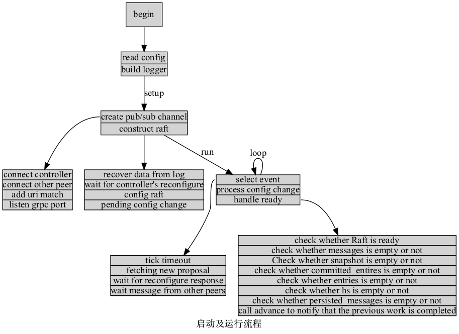

# consensus_raft
[](https://travis-ci.org/cita-cloud/consensus_raft)

`CITA-Cloud`中[consensus微服务](https://github.com/cita-cloud/cita_cloud_proto/blob/master/protos/consensus.proto)的实现，基于[raft-rs](https://github.com/tikv/raft-rs)。

## 编译docker镜像
```
docker build -t citacloud/consensus_raft .
```

## 使用方法

```
$ consensus -h
consensus_raft 6.6.0
Rivtower Technologies <contact@rivtower.com>
Consensus service for CITA-Cloud

USAGE:
    consensus [SUBCOMMAND]

OPTIONS:
    -h, --help       Print help information
    -V, --version    Print version information

SUBCOMMANDS:
    help    Print this message or the help of the given subcommand(s)
    run     run the service
```

### consensus-run

运行`consensus`服务。

```
$ consensus run -h
consensus-run
run the service

USAGE:
    consensus run [OPTIONS]

OPTIONS:
    -c, --config <config>                  the consensus config [default: config.toml]
    -d, --log-dir <log-dir>                the log dir. Overrides the config
    -f, --log-file-name <log-file-name>    the log file name. Overrride the config
    -h, --help                             Print help information
        --stdout                           if specified, log to stdout. Overrides the config
```

参数：
1. `config` 微服务配置文件。

    参见示例`example/config.toml`。

    其中：
    * `controller_port` 为依赖的`controller`微服务的`gRPC`服务监听的端口号。
    * `grpc_listen_port` 为本微服务`gRPC`服务监听的端口号。
    * `network_port` 为依赖的`network`微服务的`gRPC`服务监听的端口号。
    * `node_addr` 为本节点的标识。
2. `log-dir` 日志的输出目录。
3. `log-file-name` 日志输出的文件名。
4. `--stdout` 不传该参数时，日志输出到文件；传递该参数时，日志输出到标准输出。

输出到日志文件：
```
$ consensus run -c example/config.toml -d . -f consensus.log
$ cat consensus.log
Mar 14 08:32:55.131 INFO controller grpc addr: http://127.0.0.1:50004, tag: controller, module: consensus::client:45
Mar 14 08:32:55.131 INFO network grpc addr: http://127.0.0.1:50000, tag: network, module: consensus::client:167
Mar 14 08:32:55.131 INFO registering network msg handler..., tag: network, module: consensus::client:191

```

输出到标准输出：
```
$ consensus run -c example/config.toml --stdout
Mar 14 08:34:00.124 INFO controller grpc addr: http://127.0.0.1:50004, tag: controller, module: consensus::client:45
Mar 14 08:34:00.125 INFO network grpc addr: http://127.0.0.1:50000, tag: network, module: consensus::client:167
Mar 14 08:34:00.125 INFO registering network msg handler..., tag: network, module: consensus::client:191
```


## 设计

Please check the [`ConsensusService`](https://github.com/cita-cloud/cita_cloud_proto/blob/master/protos/consensus.proto#L12)
and [`Consensus2ControllerService`](https://github.com/cita-cloud/cita_cloud_proto/blob/master/protos/controller.proto#L53)
in [cita_cloud_proto](https://github.com/cita-cloud/cita_cloud_proto)
which defines the service that consensus should implement.

The main workflow for consensus service is as follow:
1. Get proposal either from the local controller or from other remote consensus peers.
2. If the proposal comes from peers, ask the local controller to check it first.
3. Achieve consensus over the given proposal.
4. Commit the proposal with its proof to the local controller.

The proof, for example, is the nonce for POW consensus, and is empty for non-byzantine consensus like this raft implementation.
It will be used later by peers' controller to validate the corresponding block when they sync the missing blocks from others.

To communicate with other peers, you need to:
1. Implement the [`NetworkMsgHandlerService`](https://github.com/cita-cloud/cita_cloud_proto/blob/master/protos/network.proto#L39)
which handles the messages from peers.
2. Register your service to the network by [`RegisterNetworkMsgHandler`](https://github.com/cita-cloud/cita_cloud_proto/blob/master/protos/network.proto#L35),
which tells the network to forward the messages you are concerned about.

After all of that, you can send your messages to others by [`SendMsg`](https://github.com/cita-cloud/cita_cloud_proto/blob/master/protos/network.proto#L26) 
or [`Broadcast`](https://github.com/cita-cloud/cita_cloud_proto/blob/master/protos/network.proto#L29) provided by the network service.


## 实现

[raft-rs](https://github.com/tikv/raft-rs) 提供了最核心的 `Consensus Module`，而其他的组件，包括 `Log`，`State Machine`，`Transport`，都是需要应用去定制实现。

- **Storage**  
  基于`storage trait`实现`WalStorage`，并委托`WalStorageCore`代理实现其逻辑
    - **WalStorage**
    ``` 
    #[derive(Debug)]
    pub struct WalStorage(WalStorageCore);
    ```

    ``` 
    impl Storage for WalStorage {
        fn initial_state(&self) -> raft::Result<RaftState> {
            Ok(self.0.initial_state())
        }
    
        fn first_index(&self) -> raft::Result<u64> {
            Ok(self.0.first_index())
        }
    
        fn last_index(&self) -> raft::Result<u64> {
            Ok(self.0.last_index())
        }
    
        fn term(&self, idx: u64) -> raft::Result<u64> {
            self.0.term(idx)
        }
    
        fn entries(
            &self,
            low: u64,
            high: u64,
            max_size: impl Into<Option<u64>>,
        ) -> raft::Result<Vec<Entry>> {
            self.0.entries(low, high, max_size)
        }
    
        fn snapshot(&self, request_index: u64) -> raft::Result<Snapshot> {
            self.0.snapshot(request_index)
        }
    }
    ```
    
- **Log and State Machine**  

    `log`文件内容如下图所示  
    
    
    
    `log`文件类型如下图所示  
      
    
    针对系统内不同消息，按此方式写入日志文件，`peer`启动时且`raft-wal-log.active`目录不存在、或者日志文件长度大于`compact_limit`参数，会将原有日志文件备份，保留最近`max_preserved`份备份文件

- **Transport**  

    该能力由[network](https://cita-cloud-docs.readthedocs.io/zh_CN/latest/architecture.html#network) 实现


- **启动及运行流程**  
    
  
    运行流程中的`handle ready`步骤按照[raft-rs文档](https://docs.rs/raft/latest/raft/#processing-the-ready-state) 实现

